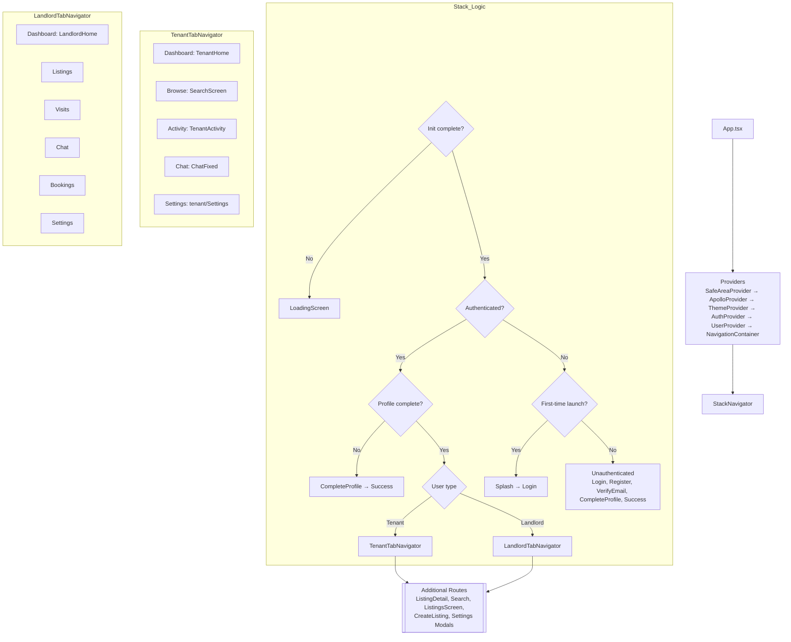

# ZenNest App Architecture & Navigation Map

Last updated: 2025-08-08

This document provides a deep, implementation-accurate overview of the React Native app architecture, providers, navigation flow, theming/auth systems, core feature modules, and known caveats. It includes a diagram of the runtime navigation decision tree and tab structures.

---

## 1) Executive Summary

- Root composition: SafeAreaProvider → ApolloProvider → ThemeProvider → AuthProvider → UserProvider → NavigationContainer → StackNavigator.
- Global status bar: ThemedStatusBar applies theme-aware styles using the imperative StatusBar API. iOS requires `UIViewControllerBasedStatusBarAppearance=false` in Info.plist.
- Navigation routing is role- and profile-driven:
  - If authenticated but profile incomplete → CompleteProfile → Success → role dashboard.
  - Else → role-based TabNavigator (Tenant or Landlord).
  - Unauthenticated users see Login/Register/Verify flows.
  - First-time Splash now shows only on initial launch (branch order fixed).

---

## 2) Technology & Libraries

- React Native (Hermes, iOS New Architecture).
- Navigation: `@react-navigation/native`, native stack + bottom tabs.
- State/context: React Context for Theme and Auth.
- Networking:
  - Apollo Client for GraphQL (listing GraphQL endpoint via auth link that reads AsyncStorage token).
  - Fetch() for REST endpoints (auth, listings, chat, payouts, banks).
- Realtime: STOMP over SockJS for chat.
- Storage: AsyncStorage for session, user, search history, theme pref.
- UI: vector-icons, Lottie animations, react-native-safe-area-context, community slider, etc.

---

## 3) Providers Tree & App Boot

File: `App.tsx`

- Providers order:
  1. SafeAreaProvider
  2. ApolloProvider (authLink adds `Authorization: Bearer <token>` from AsyncStorage)
  3. ThemeProvider (persisted theme, with system-mode support)
  4. AuthProvider (session init/TTL checks, user normalization)
  5. UserProvider (screens/UserContext)
  6. NavigationContainer → `StackNavigator`
- Global utilities:
  - ThemedStatusBar: sets `light-content`/`dark-content` by theme; for Android sets background/translucency.
  - NetworkBanner: NetInfo listener to show/hide connection status.
  - Toast: global toasts.

---

## 4) Theme System

File: `contexts/ThemeContext.js`

- Palettes: comprehensive `light` and `dark` color sets (background, surface, text tiers, brand, status, borders, shadow, overlays).
- Persistence: `themePreference` in AsyncStorage: `{ isDarkMode, isSystemTheme }`.
- System integration: listens to `Appearance` changes when in system mode.
- API:
  - `useTheme()` returns `{ isDarkMode, colors, theme, toggleTheme, setTheme, useSystemTheme, themes }`.
  - Consumers style with theme-aware design (e.g., `createStyles(colors)`).

---

## 5) Auth System & Session Management

File: `contexts/AuthContext.js`

- Session TTL: 7 days from `loginTime`; also tracks `lastActiveTime` (updated via `trackUserActivity`).
- Initialization:
  - Reads `user` and `accessToken`.
  - Validates session TTL and user shape; normalizes `{ userType: 'landlord'|'tenant', role: 'LANDLORD'|'TENANT' }`.
  - On success: sets state and `isAuthenticated=true`.
- Login flow:
  - POST `login-zennest` → receive JWT → GET `user-details` with `Authorization`.
  - Stores: `accessToken`, `user`, `userData`, `userId`, `landlordId?`, `loginTime`, `lastActiveTime`.
- Logout flow:
  - Clears session keys; optionally clears biometric credentials.
- Exposed helpers: `login`, `logout`, `register`, `loginWithBiometric`, `handleSessionExpiry`, `isSessionValid`, `resetAppState`, `clearAllAppData`, forgot-password APIs, etc.

AsyncStorage keys used (non-exhaustive):
- `user`, `accessToken`, `userData`, `userId`, `landlordId`.
- `loginTime`, `lastActiveTime`, `biometric_enabled`, `hasLaunchedBefore`, `themePreference`.

---

## 6) Navigation Architecture

Files:
- `navigation/StackNavigator.js`
- `navigation/TenantTabNavigator.js`
- `navigation/LandlordTabNavigator.js`
- `navigation/TabNavigator.js` (legacy hidden tabs)

### 6.1 Decision Tree (runtime)

### 6.2 Screens & Routes

- Auth/Onboarding:
  - `SplashScreen` (now shows only on first app launch)
  - `LoginScreen`, `RegisterScreen`, `VerifyEmailScreen`, `SuccessScreen`, `CompleteProfile`
- Tenant Tabs:
  - Dashboard: `TenantHome`
  - Browse: `SearchScreen`
  - Activity: `screens/tenant/TenantActivity`
  - Chat: `ChatFixed`
  - Settings: `screens/tenant/Settings`
- Landlord Tabs:
  - Dashboard: `LandlordHome`
  - Listings: `screens/landlord/Listings`
  - Visits: `screens/landlord/Visits`
  - Chat: `screens/landlord/Chat`
  - Bookings: `screens/landlord/Bookings`
  - Settings: `screens/landlord/Settings`
- Global stack screens:
  - `ListingDetail`, `Search`, `ListingsScreen`, `CreateListing`, Settings modals

### 6.3 First-time Splash Branch (implemented)

- The branch order in `StackNavigator` now evaluates first-time launch before returning the unauthenticated stack.
- Effect: On first launch, users see Splash → Login. Returning unauthenticated users go straight to Login. Authenticated users go to their dashboards.

---

## 7) Status Bar Strategy

- Centralized control: `ThemedStatusBar` in `App.tsx` uses imperative API:
  - iOS: `StatusBar.setBarStyle('light-content'|'dark-content', true)`
  - Android: also sets background color and translucency.
- Info.plist (iOS): must include `UIViewControllerBasedStatusBarAppearance=false` so RN can control status bar globally.
- Per-screen StatusBar cleanup: removed in `SplashScreen` and `LoginScreen` to avoid conflicts with the global approach.
- Recommendation: Audit remaining screens for any stray per-screen StatusBar usage.

Related doc: `IOS_STATUS_BAR_DARK_MODE_FIX.md` (root) explains the issue, root causes, and fix.

---

## 8) Search Subsystem

Files:
- `screens/SearchScreen.js`
- `components/MobileAdaptiveSearchBar.js`
- `components/FilterModal.js`
- `components/SearchResults.js`
- `components/PopularSearches.js`
- `components/SearchSuggestions.js`
- `components/{EmptySearchState, LoadingSearchState}.js`
- `utils/{searchIntegration.js, searchHistory.js, filterDefaults.js, locationUtils.js}`

Key points:
- Hook bridge: `useEnhancedSearch` wraps `hooks/useListingSearch` with sane defaults (`domain`/`listingPurpose`) and adds helpers: `handleLocationSelect`, `clearFilters(preserveLocation)`, `searchByLocation`, `searchByPopularArea`, `applyQuickFilter`.
- History/suggestions: `useSearchHistory` persists recent searches, calculates popularity/frequency; surfaces query suggestions.
- Search bar: Mobile-first, Google Places autocomplete, chips for price/type/dates/guests, advanced filters modal; domain-aware property types; debounce on text input.
- Results: `SearchResults` uses `NmodernCard` for RENT/BUY, simple cards for SHORT_STAY; themed; scrollable list (non-virtualized to avoid nesting issues).
- Empty/loading states: polished empty views and Lottie-driven loading.

---

## 9) Tenant Screens

- `TenantHome`:
  - Header with avatar, theme toggle, quick settings/Logout.
  - “Professional” search CTA; curated recommendations from listings search endpoint (`/listing/api/listings/search`).
  - Browse-all button navigates to `Browse` (SearchScreen).
- `screens/tenant/TenantActivity`:
  - Primary tabs: Stays vs Visits.
  - Domain badges (RENT/SHORT_STAY/BUY), status colors, detail rows; themed surfaces.

---

## 10) Landlord Screens

- `LandlordHome`:
  - Loads user profile, landlord listings (`/listing/api/listings/owner/:ownerId`), dashboard stats (`/api/landlord/:userId/dashboard-stats`), recent bookings.
  - Empty states and CTAs to create first listing.
  - Pull-to-refresh triggers fetch pipeline.
- Additional tabs: Listings, Visits, Chat, Bookings, Settings.

---

## 11) Chat Subsystem

File: `screens/ChatFixed.js` (tenant side)

- STOMP over SockJS to `https://qorelabs.space/chat`.
- Threads endpoint varies by role: `/api/chat/threads/landlord/:id` or `/tenant/:id`.
- Subscriptions:
  - Messages: `/topic/chat/:threadId` (deduplication of messages by id)
  - Status updates: `/topic/status/:userId` (read/delivered)
- Read receipts and message send via `/app/chat/:threadId`.

---

## 12) Create Listing Wizard

File: `screens/CreateListingScreen.js`

- Multi-step flow with conditional content for SHORT_STAY vs RENT/BUY.
- Google Places for address + map pin; S3 uploads for images (with optional verification endpoint); amenities/utilities/power setup; payouts (bank selection/fetch, account resolve), availability/policies; final review.
- Numerous modals and safeguards; theme-aware surfaces.

---

## 13) Other Key Screens

- `ListingsScreen`: simple feed using `/listing/api/listings/search` with fallbacks; navigates to `ListingDetail`.
- `RegisterScreen` / `VerifyEmailScreen` / `CompleteProfile`:
  - Registration path can branch to email verification, then role inference via intention; normalizes and persists full user.

---

## 14) Known Caveats & Recommendations

1) First-time Splash (fixed)
- Branch order updated in `StackNavigator` to show Splash → Login on first launch only.

2) StatusBar duplication
- Removed in Splash and Login; audit remaining screens.

3) Cross-check status bar across stacked modals
- Ensure modal presentations (Settings family) don’t force unintended bar styles; global imperative setter should win, but verify.

4) Validate all Search chips against domain
- Domain changes clear incompatible price ranges in `MobileAdaptiveSearchBar`; continue to test BUY/SHORT_STAY transitions.

---

## 15) Appendices

### 15.1 Storage Keys (observed)
- `user`, `userData`, `userId`, `landlordId`
- `accessToken`, `refreshToken?`
- `loginTime`, `lastActiveTime`
- `biometric_enabled`
- `themePreference`
- `hasLaunchedBefore`
- Search: `@ZenNest:searchHistory`, `@ZenNest:popularSearches`, `@ZenNest:recentFilters`, `@ZenNest:savedSearches`

### 15.2 Representative Endpoints
- Auth: `POST /api/zennest/users/login-zennest`, `GET /api/zennest/users/user-details`, `POST /api/zennest/users/resend-zennest-verification`, `POST /api/zennest/users/verify-zennest`
- Listings: `POST /listing/api/listings/search`, `GET /listing/api/listings/owner/:ownerId`
- Banks: `GET /zennest-fintec/api/payment/banks`
- Payout resolve: `POST /api/zennest/users/:userId/payout-info`
- Chat: `GET /chat/api/chat/threads/(tenant|landlord)/:id`, WS: `/chat/ws`, topics `/topic/chat/:threadId`, `/topic/status/:userId`, app `/app/chat/:threadId`

---

## 16) Next Steps (Suggested)
- Keep Splash first-run only and native launch screen for cold starts.
- Continue removing any stray per-screen StatusBar components.
- Optionally add a UX-friendly first-run intro before Login.
